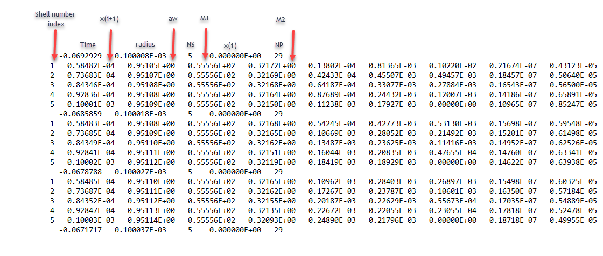

[](https://zenodo.org/badge/latestdoi/573581115)

# Respiratory Aerosol Model (ResAM) Version v1.0

## Description
ResAM calculates the radially resolved temporal evolution of the composition and pH of respiratory aerosol particles during exhalation caused by gas-particle partitioning with the ambient air and the resulting inactivation of Influenza-A-virus (IAV) and SARS-CoV-2.

The model was first used and described in detail by Luo et al. (2022).

In addition, to what was described in Luo et al. (2022), ResAM can be applied to various other solutions such as Minimum Essential Medium (MEM) and Phosphate Buffered Saline (PBS) by varying the initial composition of the droplets. Furthermore, it can also be applied to particles injected into laboratory conditions instead of modelling the exhalation process.

ResAM considers various species in the gas phase and the condensed phase. The gas phase species considered are H<sub>2</sub>O, CO<sub>2</sub>, NH<sub>3</sub>, HNO<sub>3</sub>, HCl, and acetic acid (CH<sub>3</sub>COOH). A list of all species considered in the condensed phase can be found below (species.dat). The model treats the liquid phase diffusion of neutral molecules and ions inside the droplet as well as crystallization of NaCl (efflorescence).

## Usage

This code is written in **FORTRAN 77** and has been tested using the Intel Fortran compiler. If you are not familiar with FORTRAN and need to install a compiler first, this [website](http://jupiter.ethz.ch/~pjt/FORTRAN/FortranClass.html) might be helpful for you.

To compile the main model code ResAM_v1.0.f, navigate into one of the folders providing the input files, for example: 

```
cd RH50_1um_1.0
```
and run the following code in your terminal:
```
module load intel
ifort -o ResAM_v1.0 ../ResAM_v1.0.f
```
This will create the compiled code ResAM_v1.0 in your active directory. Now check if your current directory already contains output files. If yes, then you need to delete them first with

```
rm output*
```

Once the directory contains no output files, you can run the compiled code with the following line of statement: 
```
nice ./ResAM_v1.0 > WRITE_NAME_OF_JOB &
```

With the command

```
jobs
```

you can check if the job was started and is running. 

## Files provided

We provide input and output files for two examples:

1. Folder RH50\_1um\_1.0: simulation of exhaled aerosol particles with initial radius of 1 µm and typical indoor air conditions (see Table S4 in the SI to Luo et al. (2022) for a list of the composition). For other simulations, one can modify the initial size and gas phase composition in the input.dat file
2. Folder EDB\_ResAM\_v1.0 for the electrodynamic balance (EDB) measurement simulations

### Input files
1. species.dat
2. input.dat
3. ML.dat

#### species.dat:

Specifies the properties of the species in the condensed phase: molar mass, molar volume, liquid phase diffusion coefficient, and charge.

The following species are considered:

1. H<sub>2</sub>O
2. Organics: a proxy for lighter organics in respiratory particles (e.g. lipids, antioxidants)
3. Total CH<sub>3</sub>COOH: Acetic acid is a major indoor organic acid
4. Total ammonium (NH<sub>3(aq)</sub> + NH<sub>4</sub>+): the only alkaline gas indoors and outdoors
5. Total CO<sub>2</sub> (CO<sub>2(aq)</sub> + HCO<sub>3</sub><sup>–</sup> + H<sub>2</sub>CO<sub>3</sub><sup>2–</sup> )
6. H+
7. OH<sup>–</sup>
8. CH<sub>3</sub>COO<sup>–</sup>
9. CH<sub>3</sub>COOH
10. NH<sub>4</sub>CH<sub>3</sub>COO
11. Organic: a proxy for heavier organics in respiratory particles (e.g. proteins)
12. NH<sub>4</sub><sup>+</sup>
13. CO<sub>2</sub>
14. CO<sub>3</sub><sup>2–</sup>
15. HCO<sub>3</sub><sup>–</sup>
16. Na<sup>+</sup>
17. Cl<sup>–</sup>
18. NO<sub>3</sub><sup>–</sup>
19. X<sup>+</sup> (other cations which are not already included, e.g. K<sup>+</sup>)
20. Y<sup>–</sup>(other anions, presently not used = 0)
21. Infectious titer of IAV
22. Infectious titer of SARS-CoV-2
23. NH<sub>3</sub>
24. H<sub>3</sub>PO<sub>4</sub>[^a]
25. H<sub>2</sub>PO<sub>4</sub>-[^a]
26. HPO<sub>4</sub><sup>2-</sup> [^a]
27. HSO<sub>4</sub><sup>-</sup>[^a]
28. SO<sub>4</sub><sup>2-</sup>[^a]
29. NaCl in the crystal

[^a]: In the ResAM version used for the ES&T publication (Luo et al., 2022), these compounds were not included and set equal to zero.

#### input.dat:

line 1: comment <br>
line 2: radius in cm <br>
line 3: Pressure in hPa <br>
line 4: Number of shells, Eddy diffusion coefficient in cm2/s (for the mixing of the exhaled plume with the ambient air) <br>

  - The eddy diffusion coefficient can be set to 0. The values for the initial gas phase conditions which are defined in line 7+N will then be linearly interpolated.

line 5: output mode, possible options are:

- 0: (log time)
- 1: EDB linear time
- 2: linear output time
- 3: not used
- 4: log time, for initial composition, can adjust 19 X<sup>+</sup> and 20 Y<sup>-</sup> for the desired pH
- 5: as 1, but first output time 10<sup>-5</sup s
- 10+ (0-5), as 0-5, the solid crystal is only in the center (most inner shell, ES&T version). The diffusion of the Na<sup>+</sup> and Cl<sup>-</sup> ions towards the dendritically growing crystal is treated with an enhancement factor.

In case 1-5, the NaCl crystalizes from the center towards the outer shells with a distance of 5 μm between each solid shell. The distance of 5 μm is obtained from the microscopic images of the SLF-dendritic growth (see Figure S6 in Luo et al. (2022)).

line 6 mode for pH calculation, possible options are:

- 0 : default , precise pH calculation
- 1 : less precise, recommended to use when many buffers are present such as HCO<sub>3</sub><sup>-</sup> and H<sub>2</sub>PO<sub>4</sub><sup>-</sup>.
- 2 : no pH calculation (can be used to for EDB simulations which do not require a pH simulation)

line 7 to 7+N\*


- \* The number of input lines can be adjusted to create various exhalation or laboratory gas phase scenarios which the droplet experiences
- If HCl is \> 0 or = 0, the evaporation is considered.; \< 0 : inhibits HCl evaporation for sensitivity test

#### ML.dat:

This file contains the initial molalities of all species (the number of moles of solute in a solution corresponding to 1 kg of solvent, i.e. water, units mol/kg). They are given by the synthetic lung fluid recipe by Bicer (2014) or can be calculated using the present model using imode\_output = 4 for a given composition of non-volatile species and gas phase composition. In addition, the initial water activity and pH can be specified.

### Output files:


#### output\_shells\_M.dat: molalities in each shell

- line 1, and NS\*k+ 2+k (1,7,13,19,…):
- time, radius, NS, x(1), NP
  - time: time since exhalation in seconds
  - radius: radius in cm
  - NS: total number of shells
  - x(1): inner radius of the first shell in cm
  - NP: total number of species
- Loop over the shells and NP
  - i: shell number index
  - x(i+1): outer radius of shell I in cm
  - aw: water activity of shell i in cm
  - M: molality of all species (viruses: concentrations volume<sup>-1</sup>) (from 1 to NP)
  - smisch: saturation ratio of NaCl crystal
  - xhshell: activity coefficient of H+ ions
  - pH: pH of shell i
  - xis: size of shell i-1 with only solid in shell i, used for plotting routine. The solid crystal is from x(i) – xis.



#### output\_shells\_n.dat: number of moles of all species in each shell

- i: index of shell
- time: time since exhalation in seconds
- xn: number of moles of each species

#### output\_virus.dat: relative fraction of active viruses

- time: time since exhalation in seconds
- sflu: relative fraction of infectious IAV
- ssars: relative fraction of infectious SARS-CoV-2
- xnsolid: total NaCl moles in the crystal
- Tdrop: droplet temperature
- T: air temperature

#### output\_partial.dat: time evolution of partial pressures of indoor room gases after perturbation of exhaled gases (see red curves in Fig. S11 in Luo et al. (2022))

- time : time since exhalation in s
- aw: water activity
- Acetic acid vapor pressure in ppbv
- NH<sub>3</sub> vapor pressure in ppbv
- HNO<sub>3</sub> vapor pressure in ppbv
- HCl vapor pressure in ppbv
- CO<sub>2</sub> vapor pressure in ppmv
- Mass fraction of solutes
- Mass fraction of solutes without solid crystal
- awin: water activity of ions (for diagnostics)
- Density: density of the droplet in g cm<sup>-3</sup>.


#### Output\_vapour.dat: time evolution of the vapor pressures around the droplet and mass fraction of solutes within the droplet (see black curves in Fig. S11 in Luo et al. (2022))

- time : time since exhalation in seconds
- RH: Relative humidity
- Acetic acid partial pressure in ppbv
- NH<sub>3</sub> partial pressure in ppbv
- HNO<sub>3</sub> partial pressure in ppbv
- HCl partial pressure in ppbv
- CO<sub>2</sub> partial pressure in ppmv

## Figures
The figures were created in idl and are saved in the following file: 
1. resam.ps
They can be displayed with 
```
gv idl
```
or be easily converted to pdf with a pdf reader. 

## Authors
Beiping Luo, Liviana K. Klein, and Thomas Peter

## Citing ResAM

If you use ResAM please cite the used version and/or the following published articles:

Luo, B.; Schaub, A.; Glas, I.; Klein, L. K.; David, S. C.; Bluvshtein, N.; Violaki, K.; Motos, G.; Pohl, M. O.; Hugentobler, W.; Nenes, A.; Krieger, U. K.; Stertz, S.; Peter, T.; Kohn, T., Expiratory aerosol pH: the overlooked driver of airborne
virus inactivation. *Environmental Science & Technology* **2022**

## License

©2022 ETH Zurich, Beiping Luo; Institute for Atmospheric and Climate Science; Prof. Thomas Peter. Published under GNU General Public License v3.0. 


## References
**[Bicer 2014]** Bicer, E. M., Ph.D. thesis (King’s College London) **2014**.<br>
**[Bandura 2006]** Bandura, A.V.; Lvov S.N, The ionization constant of water over wide ranges of temperature and density. *J. Phys. Chem. Ref. Data.* **2006**, 35, 15–30. <br>
**[Carslaw 1995]** Carslaw, K. S.; Clegg, S. L.; Brimblecombe, P., A thermodynamic model of the system HCl-HNO3-H2SO4-H2O, including solubilities of HBr, from <200 to 328. *K. J. Phys. Chem.* **1995**, 99, 11557–11574. <br>
**[Chapter 1 1990]** Chapter 1 The CO2-Carbonic Acid System and Solution Chemistry, *Elsevier*, **1990** <br>
**[Clegg 1998]** Clegg, S. L.; Brimblecombe, P.; Wexler, A. S., Thermodynamic model of the system H<sup>+</sup>-NH<sup>+</sup><sub>4</sub> -SO<sup>2−</sup><sub>4</sub> -NO<sub>3</sub>-H<sub>2</sub>O at tropospheric temperatures. *J. Phys. Chem. A* **1998**, 102 (12), 2137–2154. <br>
**[Harned und Echlers 1933]** Harned, H.S. and Echlers, R.W., The Dissociation Constant of Acetic Acid from 0 to 60° Centigrade. *Journal of the American Chemical Society* **1933**, 55, 652-656. <br>
**[Lienhard 2014]** Lienhard, D. M.; Huisman, A. J.; Bones, D. L.; Te, Y. F.; Luo, B. P.; Krieger, U. K.; Reid, J. P., Retrieving the translational diffusion coefficient of water from experiments on single levitated aerosol droplets. *Phys. Chem. Chem. Phys.* **2014**, 16, 16677–16683. <br>
**[Lienhard 2015]** Lienhard, D.; Huisman, A.;Krieger, U. K.; Rudich, Y.; Marcolli, C.; Luo, B.; Bones, David; Reid, J.; Lambe, A.; Davidovcits, Paul; Onasch, T.; Worsnop, D.; Steimer, Sarah; Koop, T.,. Viscous organic aerosol particles in the upper troposphere: diffusivity-controlled water uptake and ice nucleation?. *Atmospheric Chemistry and Physics* **2015**, 15. 10.5194/acp-15-13599-2015. <br>
**[Luo 1995]** Luo, B.; Carslaw, K. S.; Peter, T.; Clegg, S. L., Vapour pressures of H<sub>2</sub>SO<sub>4</sub>/HNO<sub>3</sub>/HCl/HBr/H<sub>2</sub>O solutions to low stratospheric temperatures. *Geophys. Res. Lett.* **1995**, 22, 247–250. <br>
**[Luo 1996]** Luo, B.; Krieger, U. K.; Peter, T., Densities and refractive indices of H<sub>2</sub>SO<sub>4</sub>/HNO<sub>3</sub>/H<sub>2</sub>O solutions to stratospheric temperatures. *Geophys. Res. Lett* **1996**, 23(25), 3707-3710. <br>
**[Luo 2022]** Luo, B.; Schaub, A.; Glas, I.; Klein, L. K.; David, S. C.; Bluvshtein, N.; Violaki, K.; Motos, G.; Pohl, M. O.; Hugentobler, W.; Nenes, A.; Krieger, U. K.; Stertz, S.; Peter, T.; Kohn, T., Expiratory aerosol pH: the overlooked driver of airborne
virus inactivation. *Environmental Science & Technology* **in press** <br>
**[Murphy 2005]** Murphy D.M., T. Koop, Review of the vapour pressures of ice and supercooled water for atmospheric applications. *Q. J. Royal Meteorol. Soc.* **2005**, 131, 1539–1565. <br>
**[Pinho 2005]** Pinho S.P., E.A. Macedo, Solubility of NaCl, NaBr, and KCl in water, methanol, ethanol, and their mixed solvents.  *J. Chem. Eng. Data* **2005**, 50, 29–32. <br>
**[Renard 2004]** Renard J.J., S.E. Calidonna, M.V. Henley, Fate of ammonia in the atmosphere - A review for applicability to hazardous releases. *J. Hazard. Mater.* **2004**, 108, 29–60. <br>
**[Sander 2015]** Sander, R. Compilation of Henry’s law constants (Version 4.0) for water as solvent. *Atmospheric Chemistry and Physics.* **2015**, 15. 4399-4981. 10.5194/acp-15-4399-2015. <br>
**[Walker 2021]** Walker, J. S.; Archer, J.; Gregson, F. K.; Michel, S. E.; Bzdek, B. R.; Reid, J. P., Accurate representations of the microphysical processes occurring during the transport of exhaled aerosols and droplets. *ACS Cent. Sci.* **2021**, 7, 200–209. <br>
**[Zobrist 2011]** Zobrist, B.; Soonsin, V.; Luo, B. P.; Krieger, U. K.; Marcolli, C.; Peter, T.; Koop, T. Ultra-Slow Water Diffusion in Aqueous Sucrose Glasses. *Phys. Chem. Chem. Phys.* **2011**, 13 (8), 3514. <br>
 	

